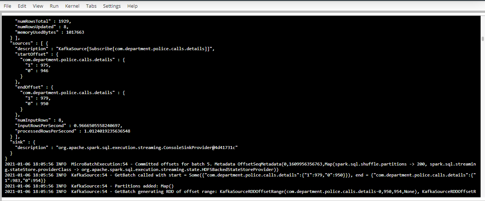

# SF-Crime-Statistics-With-Spark-Streaming

## Step-1

Steps to run the application and test it on Udacity Workspace.

1. Run Zookeeper.

  `/usr/bin/zookeeper-server-start config/zookeeper.properties`

2. Run Kafka.

  `/usr/bin/kafka-server-start config/server.properties`

3. Run the producer that inputs data from a file and produces into the topic.

  `python kafka_server.py`

4. Consumer to test whether the data is produced correctly.

  `kafka-console-consumer --topic <YOUR-TOPIC-NAME> --from-beginning --bootstrap-server localhost:9092`

### Kafka Consumer Output

consumer_server.py output

## Step-2

Submit data_stream.py as a Spark Job.

  `spark-submit --packages org.apache.spark:spark-sql-kafka-0-10_2.11:2.3.4 --master local[*] data_stream.py`

### Progress Output

### Batch Output

## Step-3

### Q-1 How did changing values on the SparkSession property parameters affect the throughput and latency of the data?

The following values were observed on the Udacity Workspace - 

  "inputRowsPerSecond" : 0.9749303621169917,
  "processedRowsPerSecond" : 0.9244585314315901

  with the parameters maxOffsetPerTrigger = 100 and maxRatePerPartition = 100

  Removing maxRatePerPartition and changing the maxOffsetPerTrigger to 200, fetchOffset.retryIntervalMs to 10 and spark.sql.shuffle.partitions to 200, we get the following observations on the Udacity Workspace - 

  "inputRowsPerSecond" : 22.498586772187675,
  "processedRowsPerSecond" : 21.653971708378673,

  Now increasing the maxOffsetPerTrigger to 400 and spark.sql.shuffle.partitions to 400 and removing fetchOffset.retryIntervalMs

  "inputRowsPerSecond" : 15.4915359527877,
  "processedRowsPerSecond" : 28.26179345516362,

  which led to a better result of processedRowsPerSecond > inputRowsPerSecond.

### Q-2 What were the 2-3 most efficient SparkSession property key/value pairs? Through testing multiple variations on values, how can you tell these were the most optimal?

1) Increasing parallelism and optimizing the partitions through the properties `spark.default.parallelism` and `spark.sql.shuffle.partitions` helps in minimizing the latency.
2) maxOffsetsPerTrigger - Rate limit on maximum number of offsets processed per trigger interval. 
3) In a multi core system, `spark.driver.cores` will help distribute work across cores but it did not have a major effect on the workspace.
